# MSIC Member & Admin User Guide

**Mbale School of Clinical Officers Investment Club**

This guide explains how to use the club's web app: signing in, checking your savings and loans, requesting withdrawals and loans, acting as a guarantor and, for administrators, running the club's records.

> The screenshots use sample data. The names, amounts and references in them are made up.

**Contents**

- [Part 1: For all members](#part-1-for-all-members)
  - [Signing in](#signing-in)
  - [Membership types](#membership-types)
  - [Finding your way around](#finding-your-way-around)
  - [Your deposit accounts](#your-deposit-accounts)
  - [Requesting a withdrawal](#requesting-a-withdrawal)
  - [Loans](#loans)
  - [Being a guarantor](#being-a-guarantor)
  - [Surcharges](#surcharges)
  - [Your statement](#your-statement)
  - [Emails you will receive](#emails-you-will-receive)
- [Part 2: For administrators](#part-2-for-administrators)
  - [The two-approval rule](#the-two-approval-rule)
  - [Dashboard](#dashboard)
  - [Members](#members)
  - [Recording contributions](#recording-contributions)
  - [Correcting or reversing a transaction](#correcting-or-reversing-a-transaction)
  - [Approving withdrawals](#approving-withdrawals)
  - [Proposing and approving loans](#proposing-and-approving-loans)
  - [Recording loan repayments](#recording-loan-repayments)
  - [Surcharges (admin)](#surcharges-admin)
  - [Reports and the audit log](#reports-and-the-audit-log)
- [Frequently asked questions](#frequently-asked-questions)

---

## Part 1: For all members

### Signing in

You sign in with the email address the club has registered for you. There is no password.

1. Open the club's app link.
2. If you are already signed in to Google, the app shows the account it found and asks **"Is this your registered club email?"**
   - Click **Yes, continue** if it is.
   - Click **Use a different email** if it is not.
3. Otherwise, enter your registered email address and click **Send code**.
4. Check your email for a 6-digit code. Enter it and click **Verify & sign in**. The code expires after **10 minutes**.

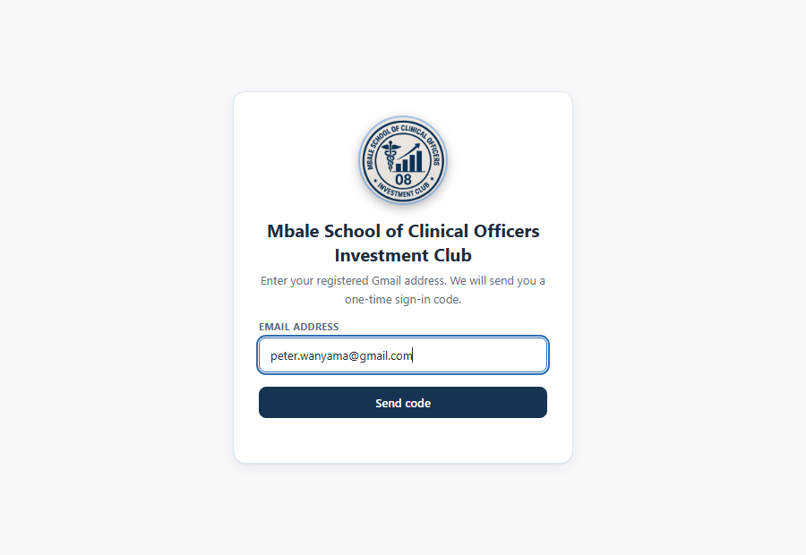

> **Didn't get the code?** Check your spam folder, or click **resend code**.
> **"Not Registered"?** The email you entered isn't on the club register, or your account is inactive. Contact the treasurer.

To sign out, click **Sign out** at the top right. **Dark mode** next to it switches the colour scheme.

### Membership types

Every member has one membership type. It decides what you can do in the app:

| | Founder Member | Delegate Member | Non-Member |
|---|:-:|:-:|:-:|
| Savings / deposit accounts | ✓ | ✓ | – |
| Withdraw from Principal, Operations, Welfare | ✓ | ✓ | – |
| Member loan (10%, minimum 2 months) | ✓ | ✓ | – |
| Soft Loan (1–4 weeks) | – | – | ✓ |
| Act as a guarantor | ✓ | – | – |

Your membership type is separate from your **role**. Admin is a role, held by some members.

If your membership type has not been set, ask an admin to set it before you request a loan.

### Finding your way around

- **On a computer**, the menu runs down the left side. Click **Collapse menu** to make it narrow.
- **On a phone**, the menu is the bar along the bottom. Tap **More** to see every section.

Your sections are **My account**, **My loans**, **My savings**, **My surcharges** and **My statement**. Admins also see an **Admin** group (see [Part 2](#part-2-for-administrators)).

The cards at the top of **My account** show your savings balance, any loan outstanding and any unpaid surcharges. Further down are your loans, your three deposit accounts, your withdrawal requests and your savings history.

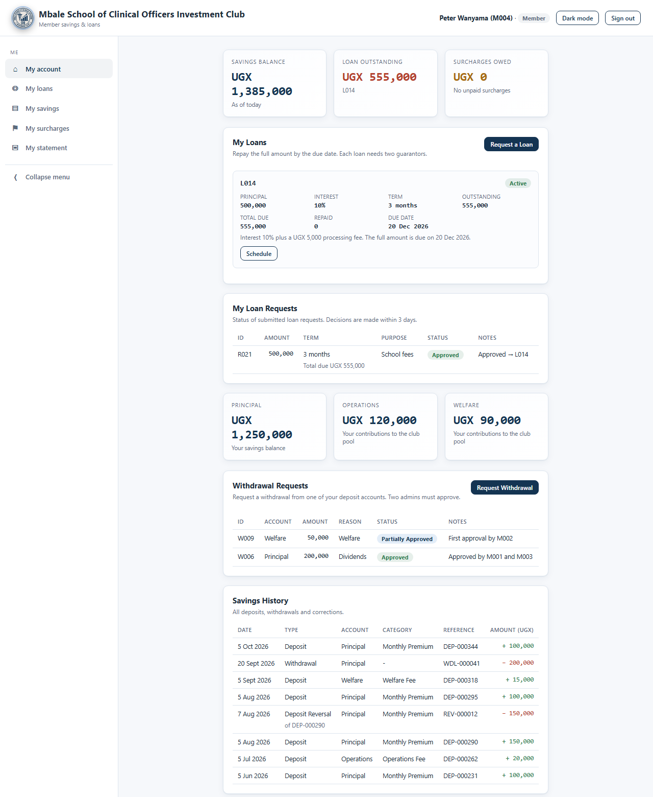

### Your deposit accounts

Your contributions are held in three separate accounts:

| Account | What it is | Who it belongs to |
|---|---|---|
| **Principal** | Your individual savings | You. Only you can withdraw your own Principal. |
| **Operations** | Contributions to the club's operations | The club, as a shared pool |
| **Welfare** | Contributions to the club's welfare fund | The club, as a shared pool |

Under **My savings** you will see:

- **Principal**: your savings balance.
- **Operations** and **Welfare**: how much *you* have contributed to each pool.
- **Savings History**: every deposit, withdrawal and correction on your account, with its date, account, category and reference.

Only **Principal** counts as your savings for loans. This affects how much you can borrow and whether you can act as a guarantor.

> **About corrections.** If an admin corrects or cancels a transaction, the original entry stays in your history. A **Deposit Reversal** or **Withdrawal Reversal** line appears beside it, marked with the reference it reverses. You are emailed whenever this happens.

### Requesting a withdrawal

Founder and Delegate Members can request withdrawals. Non-Members cannot.

1. Go to **My savings** and click **Request Withdrawal**.
2. In **Withdraw from**, choose **Principal**, **Operations** or **Welfare**. The form shows how much you can withdraw from that account.
3. Enter the **Amount**.
4. Choose a **Reason**: Exit from MSIC, Dividends, Welfare, Operations or Others. If you choose **Others**, type an explanation.
5. Click **Submit Request**.

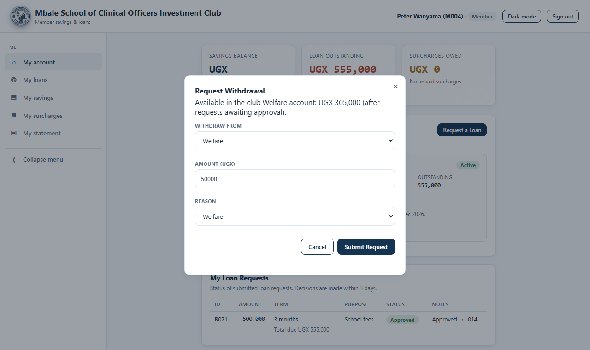

**How much can I withdraw?**

- **Principal**: up to your own Principal balance.
- **Operations / Welfare**: up to what the club currently holds in that account. It doesn't matter how much you personally contributed. You can request a Welfare withdrawal even if you have never paid into Welfare.
- Requests still awaiting approval are set aside first, so the amount shown is what is actually still available.

**What happens next?** Two different admins must approve your request. You are emailed after the first approval, and again when the money is released or if the request is rejected. Track progress in the **Withdrawal Requests** table under **My savings**:

| Status | Meaning |
|---|---|
| Pending | Waiting for the first admin approval |
| Partially Approved | One admin has approved; waiting for a second, different admin |
| Approved | Both admins approved; the amount has been taken from the account |
| Rejected | Not approved. The reason is shown under **Notes** |

### Loans

Click **Request a Loan** under **My loans**. The form shows the loan type that applies to you, and the total you will repay before you submit.

#### Member loans (Founder and Delegate Members)

- **Interest:** 10% of the amount borrowed.
- **Processing fee:** UGX 5,000.
- **Term:** at least 2 months. The full amount is due on the due date.
- **Limit:** up to 50% of your Principal savings. Admins can approve more with a recorded reason.
- **You must have been saving for at least 12 months**, counted from your first Principal deposit.

#### Soft Loans (Non-Members)

| Term | Interest |
|---|---|
| 1 week | 5% |
| 2 weeks | 10% |
| 3 weeks | 15% |
| 1 month (4 weeks) | 15% |

- **Processing fee:** UGX 10,000.
- The full amount is due on the due date.

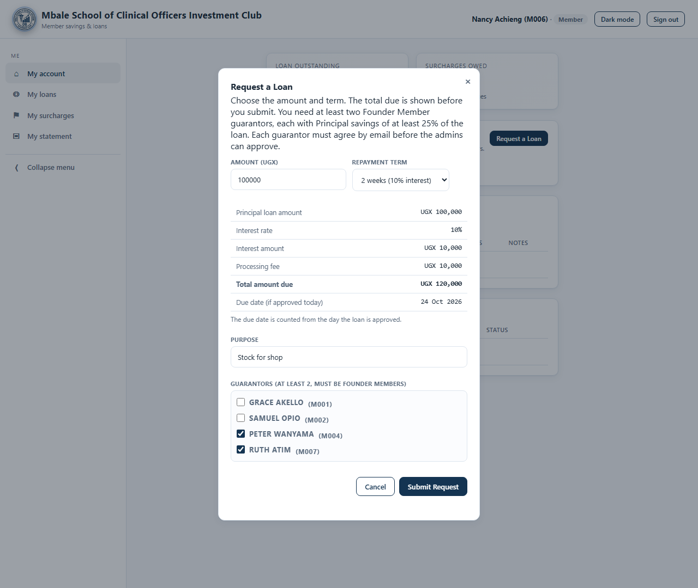

#### Rules for every loan

- You need **at least 2 guarantors**. They must be **Founder Members**, and each needs Principal savings of at least **25% of the loan**.
- Every guarantor must **agree by email** before the admins can approve your loan.
- You can't take a new loan while you have one running.
- You can't take a loan while you are guaranteeing someone else's running loan, unless an admin proposes the loan for you with a recorded override reason.
- The committee aims to decide within **3 days**.
- The **due date is counted from the day the loan is approved**, not the day you applied.

**Example: Soft Loan of UGX 100,000 for 2 weeks**

| | UGX |
|---|---:|
| Loan amount | 100,000 |
| Interest (10%) | 10,000 |
| Processing fee | 10,000 |
| **Total to repay** | **120,000** |

#### Repayment, reminders and late payment

You will receive emails:

- **3 days before** the due date;
- **on** the due date;
- if the loan is still unpaid **the day after** the due date, a **10% surcharge** on the loan plus interest is added automatically, and you are told;
- after that, a daily reminder until the loan is cleared, for up to **2 weeks**.

Pay the treasurer, who records your repayment. Your loan card under **My loans** shows the outstanding balance, due date and repayment schedule (click **Schedule**).

### Being a guarantor

Only Founder Members can be guarantors. When someone names you, you receive an email titled **"Please respond to guarantor request"** with **Approve** and **Decline** buttons.

1. Click **Approve** or **Decline** in the email.
2. A confirmation page opens. Nothing is recorded until you confirm.
3. To approve, click **Yes, approve**.
4. To decline, type your **reason** (required) and click **Yes, decline**.

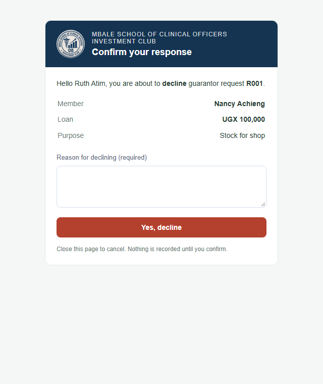

The applicant is told your answer. If you decline, the admins are told too, and the loan cannot go ahead with you as a guarantor.

**While you are guaranteeing a loan that is still running:**

- you can't guarantee anyone else;
- you can't take your own loan unless an admin approves an override.

### Surcharges

**My surcharges** lists any surcharges issued to you, with the reason and whether they are **Unpaid** or **Paid**. Settle unpaid surcharges with the treasurer.

### Your statement

Under **My statement**, click **Open PDF** to view your statement, or **Download PDF** to save it. It shows your balances in each account, all savings transactions, loans, surcharges and requests. You also receive a short summary by email on the 1st of every month.

### Emails you will receive

| When | Email |
|---|---|
| An admin records a deposit or withdrawal | Deposit / Withdrawal Confirmation |
| A transaction on your account is corrected or reversed | Contribution Corrected / Savings Transaction Reversed |
| Your withdrawal or loan request gets its first approval, is approved or is rejected | Request update |
| You are named as a guarantor | Guarantor request, with Approve / Decline buttons |
| A guarantor responds to your loan request | Guarantor response |
| Your loan is due soon, due today or overdue | Loan reminders |
| The 1st of each month | Monthly Statement |

---

## Part 2: For administrators

Admins see an **Admin** group in the menu: **Dashboard**, **Members**, **Loans**, **Savings**, **Surcharges**, **Reports** and **Audit log**. A number on **Loans** or **Savings** shows how many requests are waiting.

### The two-approval rule

Every loan and every withdrawal request needs **two approvals from two different admins**. The app enforces this:

- You **can't approve a request you started**, including a loan you proposed for a member.
- You **can't approve a request for your own account**, such as your own loan or withdrawal.
- You **can't give both approvals**.
- A **rejected** request can't be approved later.

When one of these rules applies, the app shows a note instead of the **Approve** button. Admins are emailed when a request has its first approval and needs a second.

### Dashboard

The dashboard shows member, savings, loan and surcharge totals, this month's activity and overdue loans.

The **Deposit Accounts** panel has a tab for each account: **Principal**, **Operations** and **Welfare**. Each tab shows:

- **Total contributions**: every deposit ever recorded in that account, less any reversed deposits. The figure under it is this month's contributions.
- **Withdrawals** and **Current balance**.
- A table of each member's contributions and withdrawals. For Principal, the last column is each member's balance. For Operations and Welfare, it is **Net**: the member's contributions less their withdrawals. A negative Net is normal, because members withdraw from the shared pool.

Figures are recalculated from the transaction records every time the dashboard loads, so they always match the ledger.

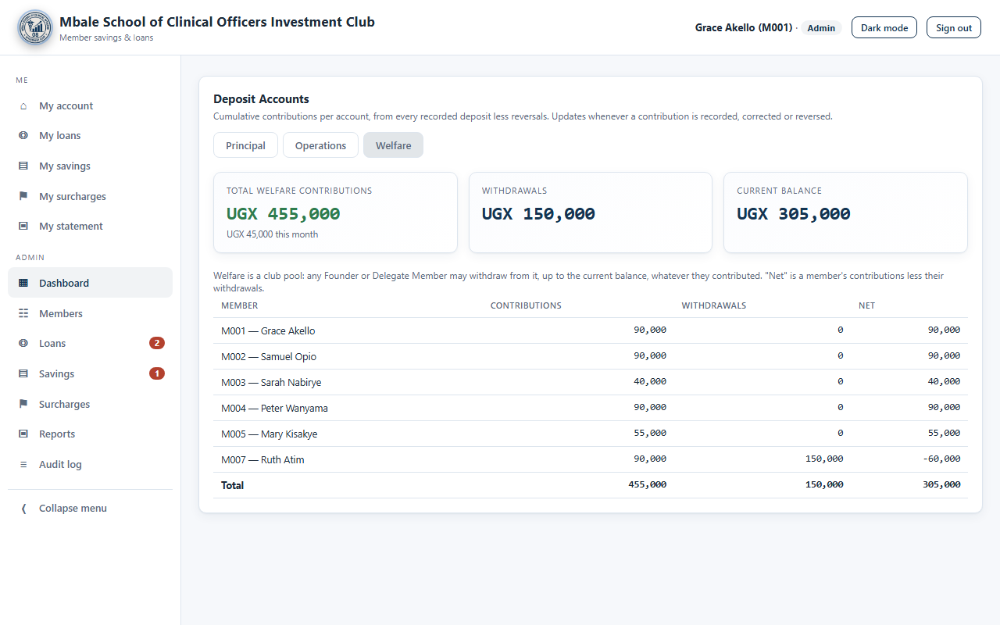

### Members

**Members** lists every member with their role, membership type, status and total savings.

- **+ Add Member**: enter the name, the email they will sign in with, their phone number, role (Member or Admin) and membership type. Member numbers (M001, M002, …) are assigned automatically.
- **Edit**: change a member's role, membership type, or status (Active / Inactive). Inactive members cannot sign in.

The buttons **Record Savings**, **Propose Loan** and **Issue Surcharge** are also on this page.

### Recording contributions

1. Under **Members**, click **Record Savings**.
2. Choose the **Member** and the **Type** (Deposit or Withdrawal).
3. Enter the **Amount** and the **Date of transaction**. It can't be a future date.
4. Choose the **Deposit account**: Principal, Operations or Welfare.
5. For a deposit, choose the **Payment category**. Only categories that belong to the chosen account are offered:

   | Account | Payment categories |
   |---|---|
   | Principal | Membership Fee, Annual Subscription Fee, Monthly Premium, Surcharge |
   | Operations | Operations Fee |
   | Welfare | Welfare Fee |

   For **Surcharge**, also choose the surcharge reason.
6. Add a **Reference / description** if you have one, such as a bank slip number.
7. Click **Save**. The member is emailed, and the entry is recorded in the audit log with your name.

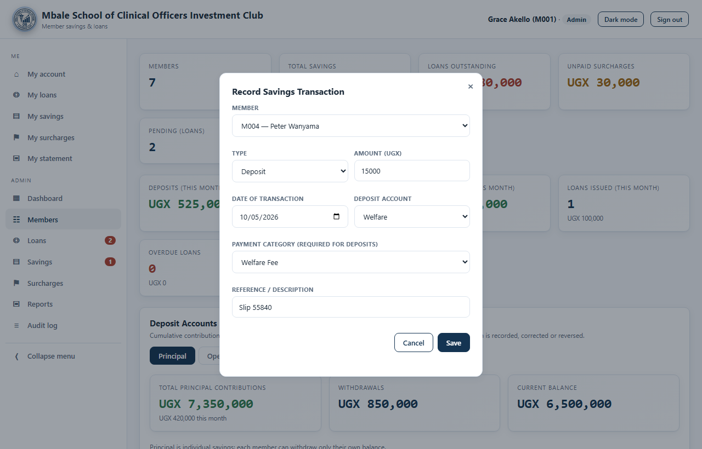

Non-Members can't have deposits. A withdrawal can't take Principal below zero, or take Operations or Welfare below what the club holds.

> A withdrawal recorded here takes effect immediately, with no second approval. For member-initiated withdrawals, use the request and approval process described below.

### Correcting or reversing a transaction

Recorded transactions are never edited or deleted. A correction adds new entries, so the full history is kept.

1. Go to **Savings → Savings Transactions**. Set the filters you need (member, type, account, category or dates) and click **Apply filters**.

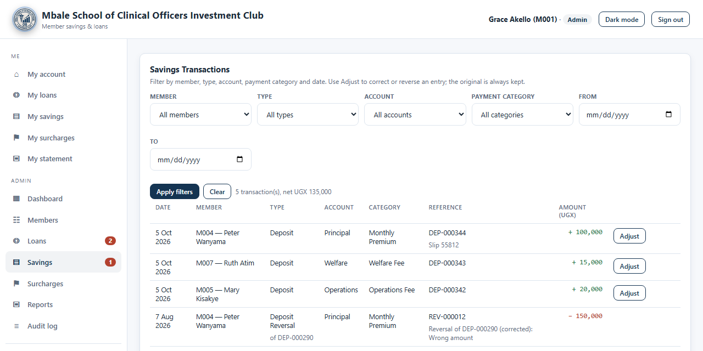
2. Click **Adjust** next to the transaction.
3. Choose an action:
   - **Correct this deposit**: change the amount, date, account or category. The original is reversed and the corrected deposit is recorded as a new entry.
   - **Reverse (cancel) this transaction**: cancels a deposit or a withdrawal.
4. Enter the **reason**. It is required and is stored in the audit log.
5. Save.

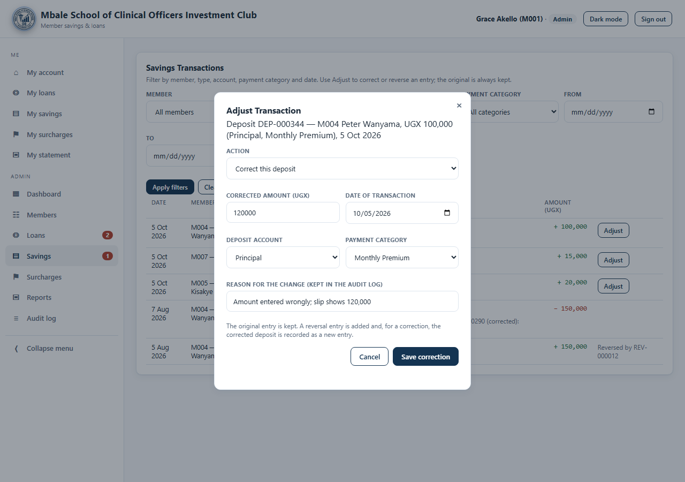

A transaction can only be reversed once. A reversal can't be reversed again, and a reversal that would take an account below zero is refused. Reversed rows show **Reversed by REV-…** in the table. The member is emailed, and the dashboard totals update straight away.

### Approving withdrawals

Withdrawal requests are listed under **Savings → Withdrawal Requests**. Each row shows the member, the account, the amount, the current account balance and the approvals so far.

- Click **Approve (1st)**, then a different admin clicks **Approve (2nd & final)**. The money is taken from the account at the final approval.
- The balance is checked again at approval time. If the account no longer has enough, approval is refused.
- To reject, click **Reject** and enter a reason. The member is emailed the reason.

For **Operations** and **Welfare**, the balance shown is the **club pool** balance.

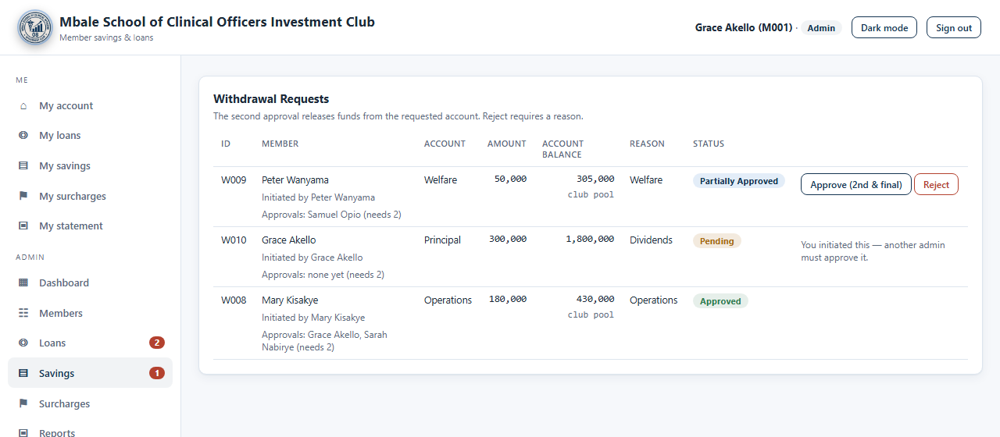

### Proposing and approving loans

**Proposing a loan for a member** (Members → **Propose Loan**):

1. Choose the member. The form switches to the right loan type for their membership type.
2. Enter the amount and term, and tick at least two Founder Member guarantors.
3. Fill in **Guarantor restriction override** *only* if the member is guaranteeing a running loan and the committee has agreed they may still borrow. Enter the reason, for example the minute number. It is stored with the request and in the audit log.
4. Click **Propose Loan**. This creates a request. It does **not** issue the loan. Because you proposed it, you can't approve it.

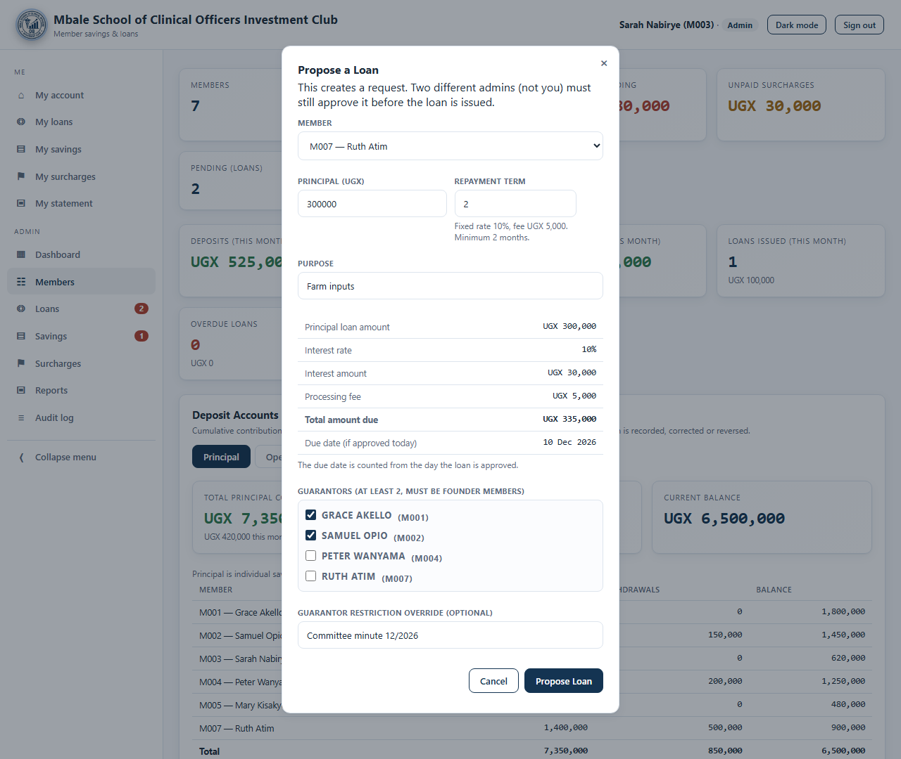

**Approving a loan request** (Loans → **Loan Requests**):

- Each request shows the guarantors and their answers (Pending / Accepted / Declined), any override, and how long it has been waiting. A request older than 3 days is flagged.
- **Approval is blocked until every guarantor has accepted.** Admins are emailed **"Ready for approval"** when the last guarantor agrees. If a guarantor declines, reject the request with a reason.
- **Member loans** show **Within limit** or **Over limit** against 50% of the member's Principal savings. To approve an over-limit loan, enter an **Override Reason**. Soft Loans have no savings limit.
- The **second** approval issues the loan, and the due date is counted from that day.

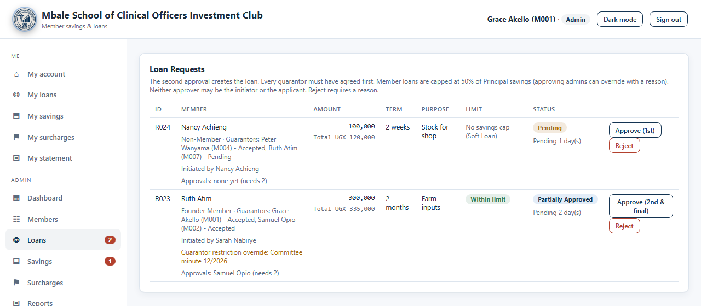

### Recording loan repayments

Open the member's loan and click **Record Repayment**. Enter the amount, the date of payment and any notes. The member is emailed the new outstanding balance. When the balance reaches zero, the loan is marked **Cleared**.

### Surcharges (admin)

- **Issue Surcharge** (on the Members page): choose the member, enter the amount and reason.
- Under **Surcharges**, click **Mark Paid** when the member pays.

The 10% overdue surcharge on single-due-date loans is applied **automatically** the day after the due date. You don't need to issue it.

### Reports and the audit log

- **Reports**: **Download Ledger PDF** (a formatted report) or **Download Ledger CSV** (for a spreadsheet). Both include members, loans, savings transactions with their accounts, and surcharges.
- **Audit log**: every action is listed with the time, the action, the member affected, who did it and the details. This covers contributions, corrections, reversals, withdrawal and loan requests, approvals, rejections, guarantor answers (with decline reasons) and overrides. Entries can't be edited in the app.

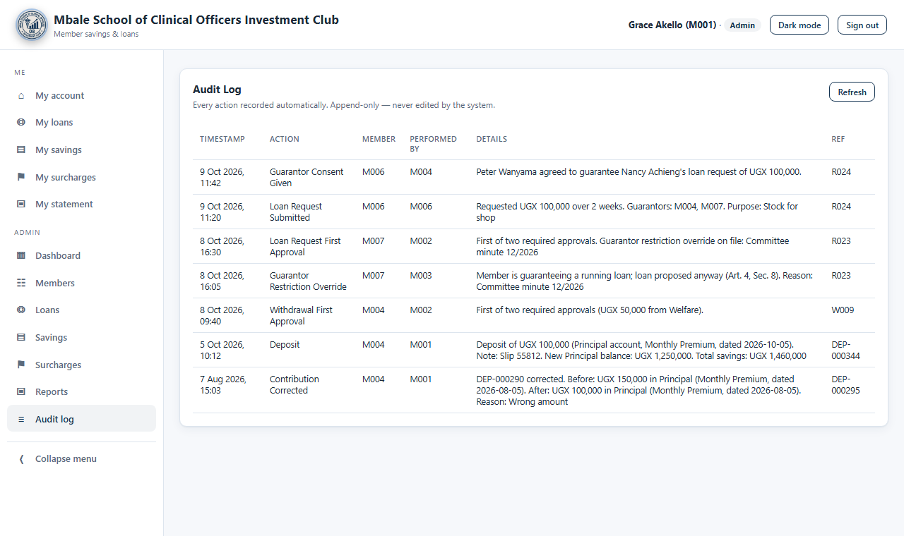

---

## Frequently asked questions

**Why can't I see "My savings"?**
Non-Members don't have savings accounts, so the section is hidden.

**Why can't I see the Request Withdrawal button?**
Withdrawals are open to Founder and Delegate Members. Ask an admin to check your membership type.

**I contributed nothing to Welfare. Can I still withdraw from it?**
Yes. Operations and Welfare are shared club pools. Founder and Delegate Members can request withdrawals up to what the club holds, whatever they contributed.

**Why is my loan limit lower than I expected?**
Only your **Principal** savings count towards the 50% loan limit. Operations and Welfare contributions don't.

**My loan request says "Waiting for guarantor".**
One of your guarantors hasn't responded to their email yet. Ask them to check their inbox and spam folder.

**A guarantor declined. What now?**
That request can't go ahead. Once an admin has rejected it, submit a new request with a different guarantor.

**An entry in my history says "Deposit Reversal".**
An admin cancelled or corrected one of your transactions. The note shows which reference it reverses, and you were emailed the reason.

**Who do I contact about a mistake?**
The treasurer or any committee admin.
